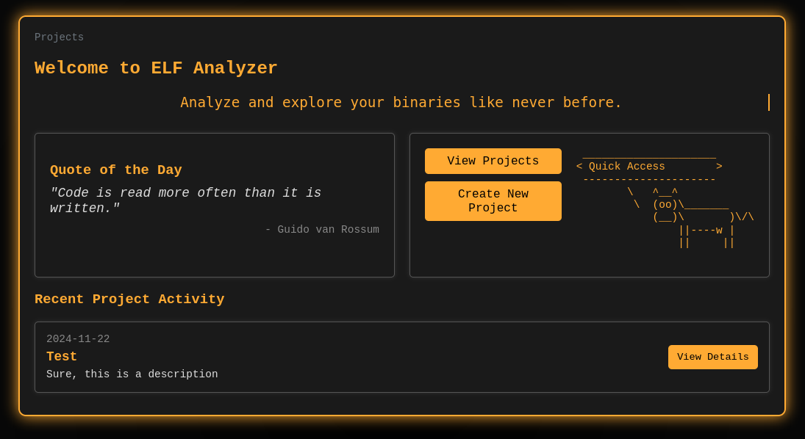

# elf-analyzer

This tool is intended to facilitate the bulk analysis of ELF files, such as when parsing through an entire firmware image.

The tool has built to help answer complicated 'big-data' style questions that arise when analyzing firmware, such as "What other binaries use this shared library?" or "Do all of the binaries on this system contain that specific ELF header?"

The project is **very much a work in progress!** Not all features or functionality are fully working, but I'd love any and all feedback.

## Screenshot

<p align="center">
	
</p>

Additional screenshots are included in the [screenshots/ folder](screenshots/README.md).

## Features

- Create a new project and pass it a directory to scan for binaries
- The program will enumerate all ELF files within the directory (and all subfolders)
- The program will run a number of analysis techniques on each identified binary and store the results in a database
	- Currently, these analyzers are somewhat rudimentary and include:
		- Run `file` on the binary to determine specific ELF file type and debug info
		- Run `strings` on the binary to extract all strings
		- Generate the SHA256 hash of the binary
		- Run `ldd` on the binary to extract list of shared libraries
- A project landing page will be generated that allows you to browse through and filter all binary results
- Specific binaries can be inspected
	- Each binary's strings can also be exported to a text file

That's all for now! There is a massive TODO list for this project - see bottom of README for more info.

## (Optional) Set Up Python venv

You can optionally set up a Python virtual environment to ensure you don't cause conflicts with your main Python environment:

```
python3 -m venv elf-analyzer-venv
source elf-analyzer-venv/bin/activate
```

## Dependencies

Python dependencies can all be installed using pip:

```
pip install -r requirements.txt
```

## Launching the Tool

To launch the tool, simply execute `app.py`:

```
python3 app.py
```

Then, navigate to `http://localhost:5000` in your web browser and you should see the application's UI!

## Project Structure

```
elf-analyzer/
├── app.py                # Main Flask application
├── add_quotes.py         # A silly mini tool to add additional quotes of the day
├── models.py             # Database models
├── utils.py              # Helper functions (hashing, string extraction, etc.)
├── scan_folder.py        # Folder scanning and binary analysis logic
├── state.py              # Global shared state (progress tracking)
├── instance/
│   ├── elf_analyzer.db   # The application's database
├── routes/               # Modularized route files
│   ├── __init__.py       # Initializes the blueprint package
│   ├── project_routes.py # Routes for project management
│   ├── binary_routes.py  # Routes for binary operations
│   └── scan_routes.py    # Routes for scanning and progress tracking
├── templates/            # HTML templates for Flask to use
│   ├── base.html           # Base template for each page of the application
│   ├── binary_details.html # Template for /binary/[binary_id] endpoint
│   ├── create_project.html # Template for /projects/create endpoint
│   ├── details.html        # Tempalate for /projects/[project_id] endpoint
│   ├── index.html          # Template for main homepage
│   ├── progress.html       # Template for scan progress page
│   └── projects.html       # Template for /projects endpoint
├── static/               # Static assets for React frontend
│   ├── css/
│   │   └── styles.css    # Application styles
│   ├── js/
│   │   ├── base.js       # JS logic for base page (title text effects and background)
│   │   ├── filter.js     # JS logic for result filtering
│   │   └── progress.js   # JS logic for progress bar and status updates
├── strings-dumps/        # Output folder generated to store string dumps
└── migrations/           # Flask-Migrate files for database management
```

## TODO - Features and Bugs

- Break out CSS from one cursed mega stylesheet into multiple template-specific files
- Add button to delete project
- Add additional binary analysis techniques
	- Fix shared library detection (ldd is unreliable depending on architecture)
	- Add ability to run headless Ghidra techniques against binaries
- Add architecture detection support
- Add overview panel that gives binary counts, detected architecture, common metadata, etc.
- Add option to use anime art instead of cowsay on homepage (lol)
