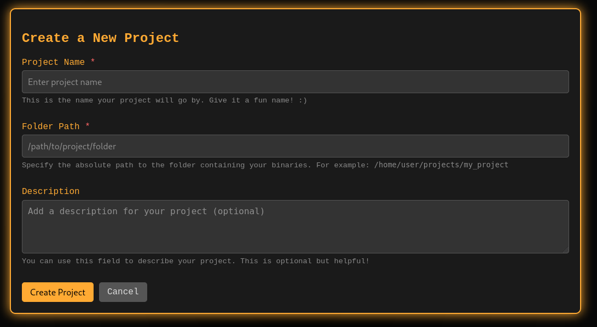
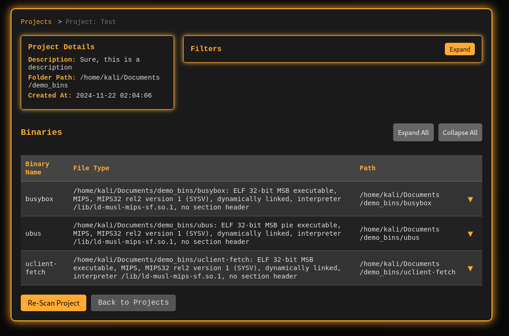
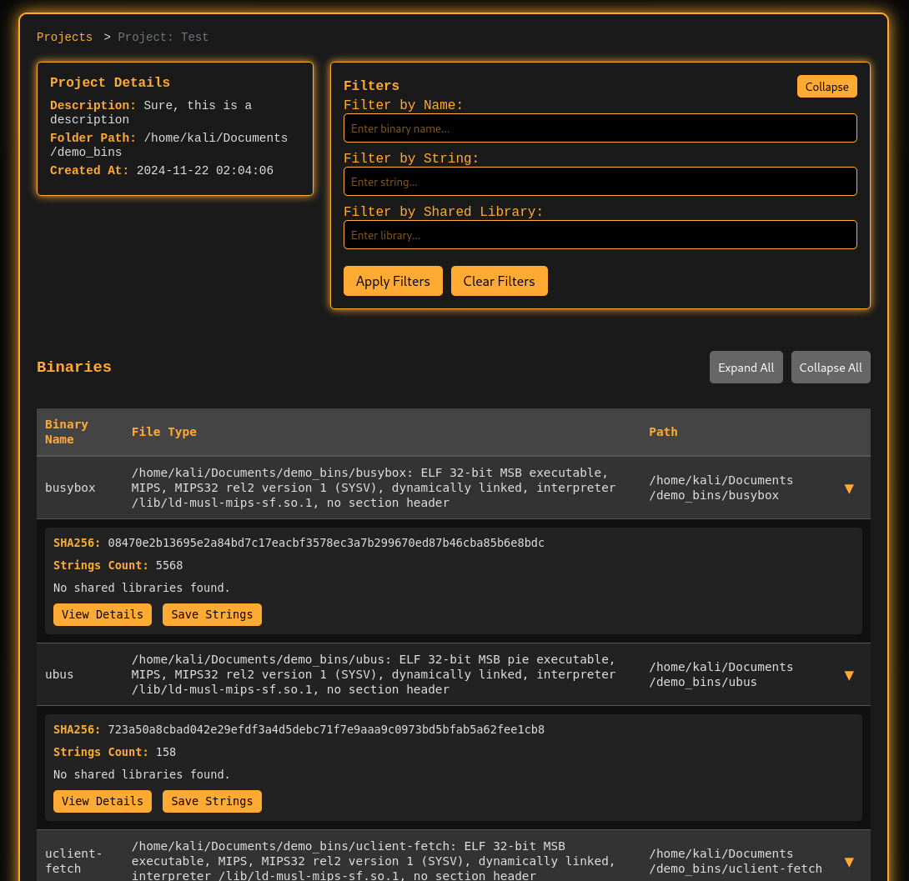
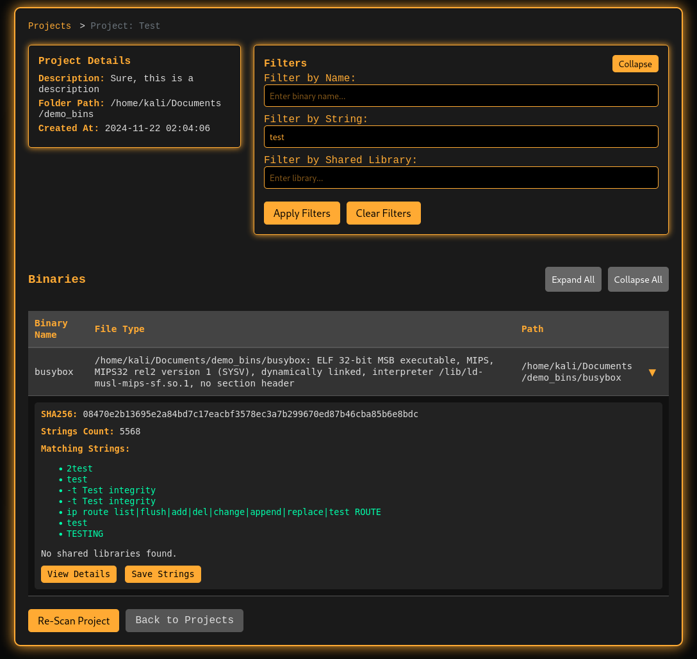
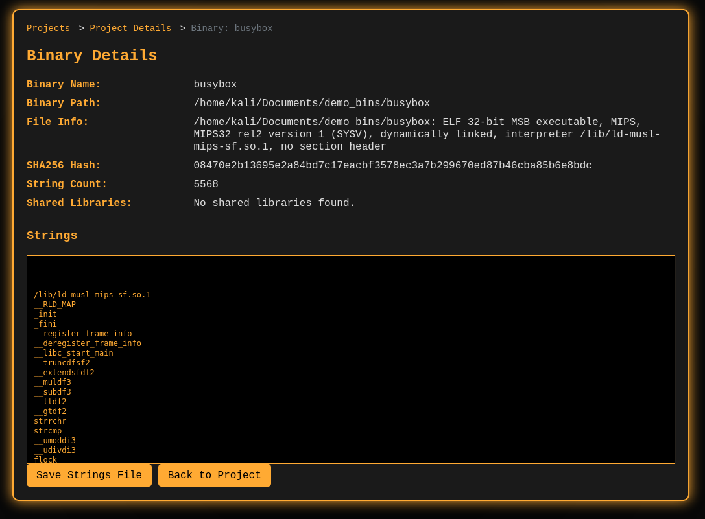

# Screenshots

The homepage of the application:

The form used to create a new project:

Once a project is created and the binaries have been analyzed, this is the main project view:

You can also expand the details of each binary in this view:

You can also apply filtering - here, the binaries are being filtered for the string 'test':

You can also drill down into a specific binary's details, as shown here:

